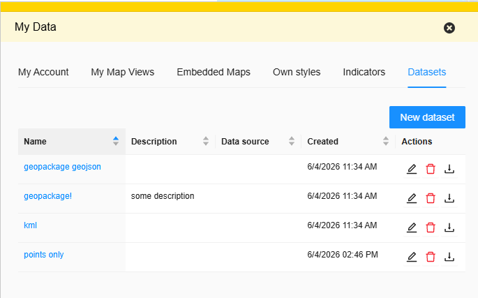

## MyFeatures - own datasets (requires backend)

The `myfeatures` bundle allows a logged in user to bring their own vector data into Oskari. Data can either be imported from a file or created feature-by-feature by drawing directly on the map. When the optional `mydata` bundle is available, the user's datasets are listed and managed under the "My Data" functionality's own tab.

The bundle requires the user to be logged in - the toolbar tools it registers are disabled for guest users and the layer listing/import/edit functionality isn't initialized for a guest session. It also requires backend support in `oskari-server` for the REST routes it uses (`MyFeaturesLayer`, `MyFeaturesFeature`, `ImportMyFeatures`, `ExportMyFeaturesLayer`).

MyFeatures map layers appear in the list of all map layers and in published maps with the layer type `wfs`, not `myf`. They can be identified as MyFeatures layers by the `myf` prefix in their layer IDs.

### Listing and managing datasets

The bundle loads the logged in user's datasets and registers them with the map layer service. The My Data tab lists each dataset's name, description, data source and creation date. Clicking a dataset's name adds it to the map and zooms to its contents. The list also provides actions for editing a dataset, deleting it with confirmation, and exporting/downloading it as GeoJSON. The list is refreshed when layers are added, updated or removed.



### Importing a dataset

The bundle registers a toolbar tool (upload icon) that opens a file upload dialog. Users can upload:

- Shapefile (`.shp`, `.shx`, `.dbf`, `.prj`, optionally `.cpg`) as a zip
- MapInfo MID/MIF as a zip
- GPX (`.gpx`)
- KML (`.kml`)
- GeoPackage (`.gpkg`)
- GeoJSON (`.json` or `.geojson`)

Multi-file formats (Shapefile, MapInfo) need to be packaged as a zip file containing only the files needed for one dataset. Single file formats (GPX, KML, GeoPackage, GeoJSON) can be uploaded as-is.

The maximum upload size is configurable (see [Configuration](#configuration)) and files extracted from a zip archive can be up to 15 times as large as the configured maximum. If the source data's projection can't be detected (for example a shapefile with a missing `.prj` file), the user is asked to enter the EPSG code before the import.

While importing, the user also fills in the dataset's name, description and data source, and can configure the layer's visualization style. If the backend rejects the data, error messages are localized based on the error/cause code returned by the server, for example unknown projection, invalid file format, too many/ambiguous files in the zip, file size exceeded or no features found in the data.

An imported dataset is added to the map automatically. If the import succeeds but some features are skipped, the user is shown a warning with the number of skipped features. The attribute schema comes from the imported file; the Attributes tab is not shown during import.

### Creating and editing a dataset

Instead of importing a file, a user can create an empty dataset ("New dataset" in the My Data tab) and populate it by drawing features on the map. Existing datasets can be edited from the list or through the layer's edit tool in the selected layers view. Creating or editing a dataset opens a popup form with the following tabs:

- **Basic information** - name, description and data source (localized per configured language)
- **Visualization** - the style used to render the dataset's features on the map
- **Attributes** - the dataset's fields and their presentation settings (see below)


Saving updates the dataset's settings and refreshes its style and contents if it is already on the map. The form also provides an "Add feature" action for an existing dataset.

#### Editing attributes

When creating a dataset, the Attributes tab lets the user add and remove fields and choose each field's type (`String`, `Integer`, `Double`, `Date`, `Timestamp` or `Boolean`). A new dataset starts with a `name` field of type `String` and must have at least one field. Once the dataset has been saved, fields cannot be added or removed and their types cannot be changed through this form.

For both new and existing datasets, the user can configure which fields are shown by default and in which order, edit localized display names, and configure value formatting. Display names and formatting are edited in separate dialogs opened from the field's row. These presentation settings are saved with the dataset.


#### Attribute value presentation

The **Attribute value presentation** modal opens from the settings (gear) icon in an attribute's row. It controls how the attribute's value is formatted in the feature info popup shown when a feature is clicked on the map. For example, a value can be displayed as a clickable link, an image or styled text. The modal also provides options to hide the attribute's label or omit empty values. Save the modal and then the dataset form to apply these presentation settings.

Value presentation is separate from the attribute's technical data type. The technical type determines how the field is shown when editing a feature: for example, `String` uses a text input, numeric types use a number input, and `Date` uses a date picker. Presentation settings do not change the stored value, its technical type or the editor's input control. A `String` attribute containing a website address can therefore appear as a clickable link in the feature info popup while remaining a text input in the Feature Editor.

### Adding and editing individual features

A second toolbar tool (draw icon), the dataset form's "Add feature" action and the map layer's per-feature edit tool open the draggable Feature Editor popup. It lets the user:

- pick which of their datasets a new feature is added to (if not already selected), or open the form to create a new dataset
- draw the feature's geometry on the map - points, lines and areas
- fill in the feature's attribute values based on the dataset's attribute schema
- delete a feature (with a confirmation dialog)

### Configuration

Configuration is optional:

```javascript
conf: {
  maxFileSizeMb: 10
}
```

`maxFileSizeMb` sets the maximum import file size in megabytes and defaults to 10 MB. The maximum unzipped size is 15 times this value.

The bundle opens its dataset and feature editors through UI callbacks. It does not register sandbox requests for opening these editors.
